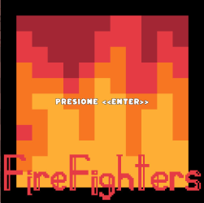
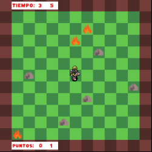
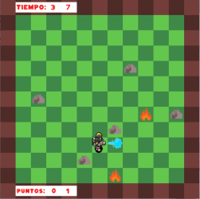
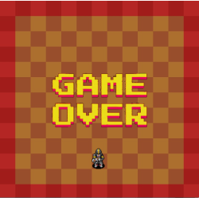
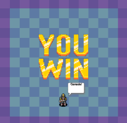

##FireFighters :man: :fire_engine:

## Equipo de desarrollo

- Fautario, Lautaro
- La Cava, Juan Eduardo
- Martin, Julieta
- Rodriguez, Carolina

## Capturas

## Reglas de Juego / Instrucciones

El jugador deberá **sumar 20 puntos** en 40 segundos para ganar la partida.

Cada fuego apagado sumará 1 punto.

Al iniciar la partida el jugador tiene 3 vidas. En caso de tocar el fuego perderá una de ellas.

La partida se perderá cuando:
 
	- El jugador pierda :heart: :heart: :heart: vidas

	- No logre sumar los 20 puntos antes de finalizar el conteo

	- Se acumulen 5 :fire: en el tablero

## Comandos

:fire: Flechas/ WASD: Desplazamiento

:fire: Barra espaciadora: Tirar agua

## Otros

:fire: Objetos 1, Universidad UNAHUR

:fire: Versión de wollok

:fire: Una vez terminado, no tenemos problemas en que el repositorio sea público
